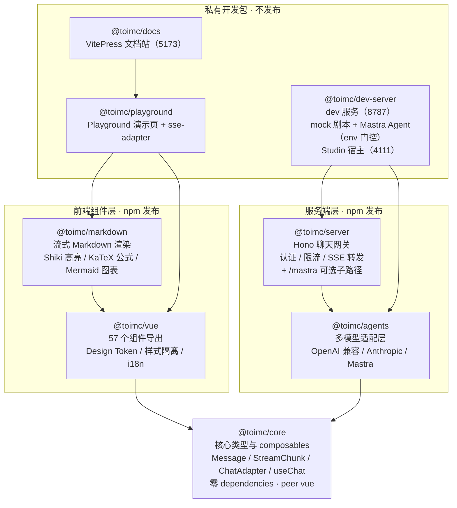
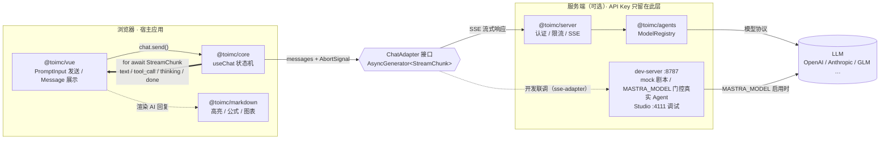
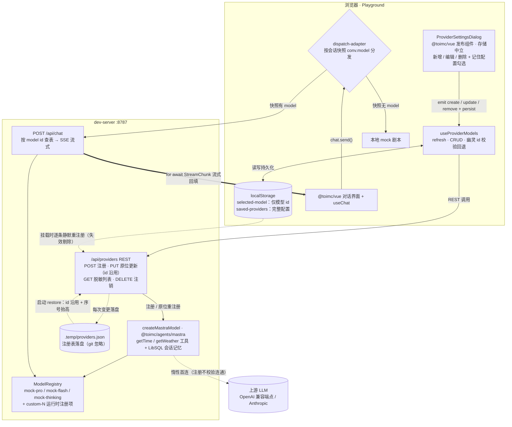

# ai-chat-ui

后端无关的 AI 聊天界面组件库，基于 Vue 3 + TypeScript。

## 特性

- **Provider 抽象层**：组件与 AI 后端完全解耦，通过 `ChatAdapter` 接口适配任何后端
- **57 个可组合组件**：Conversation / Message / Thinking / PromptInput / Comparison / Attachment / ToolCall / Citation / Welcome / Preview / Provider / Shared 十二个能力域
- **Design Token 体系**：三层 CSS Variables（原始→语义→组件），暗色/亮色双主题
- **样式隔离**：全部库样式收在 `@layer` 级联层内，不污染宿主；宿主一行未分层 CSS 即可覆盖任意组件样式，无需 `!important`
- **ToolCall 可视化**：原生支持 AI 工具调用（function call）的参数、结果和状态展示
- **思考过程展示**：`thinking` chunk 流式呈现推理内容，done 时自动计算耗时并折叠为一行触发器（内置 ThinkingBlock，经 `MessageContent` 的 `thinking` prop 驱动）
- **A/B 回复对比**：`Message.comparison` 载荷驱动 ComparisonMessage 双列对比，用户点选后选中内容原地固化为普通消息
- **AsyncGenerator 流式渲染**：`sendMessage` 返回 `AsyncGenerator<StreamChunk>`，原生支持流式输出
- **零 CSS 框架依赖**：不绑定 Tailwind / UnoCSS 等框架
- **Monorepo 按需安装**：每个包独立发布，只装需要的
- **服务端网关**：`@toimc/server` 基于 Hono 的接收与转发层（Bearer 认证 / 限流 / CORS 可选启用），`@toimc/agents` 多模型协议适配（OpenAI 兼容 / Anthropic / 自定义），API Key 只留服务端
- **Mastra Agent 接入**：`@toimc/agents/mastra` 可选子路径把 Mastra Agent 包装成标准适配器（工具调用 / 会话记忆 / 配合 Mastra Studio 监控），`@mastra/core` 为可选 peer 依赖（`^1.60.0`，未安装时 `createMastraModel` 抛含安装指引的友好错误）
- **provide/inject 状态管理**：支持同一页面多个独立对话实例

## 技术栈

| 类别     | 技术                     | 版本        |
| -------- | ------------------------ | ----------- |
| 框架     | Vue 3                    | ^3.5        |
| 语言     | TypeScript               | ^6.0        |
| 构建     | Vite                     | ^8.0        |
| 包管理   | pnpm workspace           | ^11.0       |
| 单元测试 | Vitest + @vue/test-utils | ^4.1 / ^2.4 |
| E2E测试  | Playwright               | ^1.62       |
| 文档站   | VitePress                | ^1.6        |

## 项目结构

```
ai-chat-ui/
├── packages/
│   ├── core/                  # @toimc/core — 核心类型与 composables（零 dependencies，peer 依赖 vue）
│   │   ├── src/types/         # Message, StreamChunk, ChatAdapter, ToolCallInfo
│   │   ├── src/composables/   # useChat（流式消费 + tool_call 处理）
│   │   ├── src/utils/         # generateId, createUserMessage, createAssistantMessage
│   │   └── __tests__/         # 测试（镜像 src 结构，各包同）
│   │
│   ├── vue/                   # @toimc/vue — 57 个组件导出（12 个能力域）
│   │   └── src/
│   │       ├── styles/        # tokens.css + animations.css（Design Token 体系）
│   │       ├── conversation/  # Conversation / Content / Empty / ScrollBtn
│   │       ├── message/       # Message / Content / Actions / Attachments / ThinkingBlock / Feedback / BranchPicker + 四个预设 Action
│   │       ├── thinking/      # ThinkingChain（多步骤思考链时间线）
│   │       ├── prompt-input/  # PromptInput / Textarea / Submit / Footer / Tools / Button / Header / UploadButton / Attachments / Suggestion
│   │       ├── attachment/    # Attachments / Attachment / Preview / Info / Remove / Empty
│   │       ├── tool-call/     # ToolCall / Header / Content / Input / Output / Confirmation
│   │       ├── citation/      # InlineCitation / Sources（引用溯源）
│   │       ├── welcome/       # Welcome / Prompts（欢迎引导）
│   │       ├── comparison/    # ComparisonMessage（A/B 对比）
│   │       ├── preview/       # ImageLightbox
│   │       ├── provider/      # ProviderSettingsDialog
│   │       ├── shared/        # StreamText / Button / Shimmer / Toast / Input / Select / Radio / LanguageToggle / ModelIcon / JsonDiffView
│   │       ├── composables/   # useScrollAnchor / useTheme / useThemePreset / useMarkdownRenderer / useClipboard / useLayoutConfig
│   │       ├── theme/         # presets（主题预设）+ tokens-meta（令牌元数据）
│   │       └── locales/       # aiChatI18n 双语字典
│   │
│   ├── markdown/              # @toimc/markdown — Markdown 渲染
│   │   └── src/
│   │       ├── components/    # MarkdownRenderer / CodeBlock / LatexBlock / MermaidBlock
│   │       ├── composables/   # useMarkdownIt / useHighlighter / useShikiTokenizer / useStreamingMarkdown
│   │       └── renderers/     # tokensToHtml
│   │
│   ├── agents/                # @toimc/agents — 服务端模型适配层（零外部依赖）
│   │   └── src/               # IModelAdapter / ModelRegistry / OpenAI 兼容与 Anthropic 适配器 / SSE 解析 / mastra 可选子路径（Mastra Agent 包装）
│   │
│   ├── server/                # @toimc/server — Hono 聊天网关（接收与转发）
│   │   └── src/               # createChatGateway / chat·models·health 路由 / auth·rateLimit 中间件 / mastra 子路径（createMastraGateway）
│   │
│   ├── dev-server/            # @toimc/dev-server — 私有 dev 服务（8787，pnpm dev 随文档站启动）
│   │   └── src/               # mock 剧本 / Agent 定义收敛（chat-agent / docs-agent 组件库助手 + orchestrator-agent 多 Agent 编排，MASTRA_MODEL 门控）/ 语义检索管线（EMBEDDING_MODEL 门控）/ MCP 双向（context7 客户端 + weather 宿主）/ Studio 宿主（4111，pnpm dev:studio）
│   │
│   ├── playground/            # @toimc/playground — Playground 演示包（私有）
│   │   └── src/               # PlaygroundDemo / 主题构建器 / 各功能演示组件 / sse-adapter · dispatch-adapter 前端适配器
│   │
│   └── docs/                  # @toimc/docs — VitePress 文档站
│       └── .vitepress/
│           ├── components/    # DemoContainer（演示容器）
│           └── theme/         # 全局组件注册
```

## 架构图

### 包依赖关系

箭头从使用方指向被依赖方（`workspace:*`），仅画出主要依赖边，完整依赖见各包 `package.json`：



### 运行时数据流

前端只认 `ChatAdapter` 接口，后端任选；API Key 只留在服务端：



### 运行时 Provider 注册链路（自定义模型接入）

用户在设置对话框中填写 OpenAI 兼容 / Anthropic 端点即可注册自定义模型：注册即组装为带工具与会话记忆的 Mastra Agent 模型进入 `ModelRegistry`，当前会话立即可用；浏览器与服务端各有一层持久化，页面刷新与服务重启都不丢配置：



- **apiKey 边界**：表单 `emit` 瞬间交给宿主；服务端只进内存 / env 注入 / `.temp` 本地落盘（git 忽略），`GET /api/providers` 只回脱敏视图（不含 key，`baseURL` 供编辑预填）
- **双层持久化**：服务端 `.temp/providers.json` 应对 dev 期 watch 重启（id 沿用、自增序号抬高防撞）；浏览器 `saved-providers` 应对服务重启（挂载时逐条静默重注册，失效条目剔除）。发布组件自身存储中立，「记住配置」勾选经 `payload.persist` 交宿主决策
- **会话级模型分发**：各会话自持 `model` 快照，`dispatch-adapter` 按快照分发——有值走 `POST /api/chat`（SSE 真实模型），无值回退本地 mock 剧本；顶部切换模型即时改写当前会话快照，编辑重发随新模型走
- **输入归一化**：model id 自动补 `openai/` 前缀、端点 URL 统一剥除 `/chat/completions` 归一为 base 形态——裸模型名、base / 整段粘贴端点两种填写习惯均归一正确

## 快速开始

### 安装

```bash
pnpm add @toimc/core @toimc/vue @toimc/markdown
```

样式经 `@toimc/vue/style.css` 子路径导出，入口引入一次（含 Design Token 与组件样式）：

```ts
import '@toimc/vue/style.css'
```

### 基本用法

```vue
<script setup lang="ts">
import '@toimc/vue/style.css'
import { useChat } from '@toimc/core'
import {
  Conversation,
  ConversationContent,
  ConversationEmpty,
  Message,
  MessageContent,
  MessageActions,
  MessageAction,
  PromptInput,
  PromptInputTextarea,
  PromptInputSubmit,
  PromptInputFooter,
  PromptInputTools,
} from '@toimc/vue'
import type { ChatAdapter } from '@toimc/core'

const adapter: ChatAdapter = {
  async *sendMessage({ messages, signal }) {
    const res = await fetch('/api/chat', {
      method: 'POST',
      headers: { 'Content-Type': 'application/json' },
      body: JSON.stringify({ messages }),
      signal,
    })
    const reader = res.body!.getReader()
    const decoder = new TextDecoder()
    while (true) {
      const { done, value } = await reader.read()
      if (done) break
      yield { type: 'text', content: decoder.decode(value, { stream: true }) }
    }
    yield { type: 'done', content: '' }
  },
}

const chat = useChat(adapter)
</script>

<template>
  <Conversation>
    <ConversationContent>
      <ConversationEmpty v-if="chat.messages.length === 0">
        <h3>有什么可以帮你的？</h3>
      </ConversationEmpty>

      <Message v-for="msg in chat.messages" :key="msg.id" :from="msg.role">
        <MessageContent>{{ msg.content }}</MessageContent>
      </Message>
    </ConversationContent>

    <PromptInput>
      <PromptInputTextarea @send="(t) => chat.send(t)" />
      <PromptInputSubmit />
    </PromptInput>
  </Conversation>
</template>
```

## 组件一览

57 个组件按 12 个能力域组织，每个组件的完整 API（Props / Events / Slots / 交互示例）见文档站「组件」栏目（`packages/docs/`，`pnpm dev` 本地启动）：

| 能力域 | 组件 | 核心能力 |
| ------ | ---- | -------- |
| 对话容器 | Conversation、ConversationContent、ConversationEmpty、ConversationScrollBtn | 滚动容器与「回到底部」、消息区、欢迎屏 |
| 消息渲染 | Message、MessageContent、MessageActions、MessageAction、MessageAttachments、ThinkingBlock、MessageFeedback、BranchPicker、MessageActionCopy · Retry · Edit · Feedback（预设） | 消息项与正文（Markdown / 思考块 / 流式状态）、操作按钮、附件、点赞点踩、分支回复选择、复制/重发/编辑/反馈预设 |
| 思考链 | ThinkingChain | 多步骤思维链时间线（pending / active / complete / error 分步状态） |
| 输入系统 | PromptInput、PromptInputBody、PromptInputTextarea、PromptInputFooter、PromptInputTools、PromptInputButton、PromptInputSubmit、PromptInputHeader、PromptInputUploadButton、PromptInputAttachments、PromptInputSuggestion | 自适应输入（sendKey 键位切换、IME 防御）、多模态附件管道（上传/粘贴/拖拽）、建议词触发 |
| 偏好对比 | ComparisonMessage | A/B 双列对比，点选收集用户偏好后原地固化 |
| 附件展示 | Attachments、Attachment、AttachmentPreview、AttachmentInfo、AttachmentRemove、AttachmentEmpty | grid / inline / list 布局、图片缩略图、hover 删除 |
| 工具调用 | ToolCall、ToolCallHeader、ToolCallContent、ToolCallInput、ToolCallOutput、ToolConfirmation | 可折叠面板、参数/结果 JSON、等待审批等 6 态状态机、人工确认交互 |
| 引用溯源 | InlineCitation、Sources | 行内引用角标（quote 片段）与来源列表（http(s) 白名单外链） |
| 欢迎引导 | Welcome、Prompts | 首屏欢迎语与推荐提示词模板 |
| 图片预览 | ImageLightbox | 灯箱预览（Esc 关闭、方向键翻页，可独立使用） |
| 模型接入 | ProviderSettingsDialog | 自定义模型端点的新增 / 编辑 / 删除表单（存储中立，密钥交宿主） |
| 通用 | StreamText、Button、Input、Select、Radio、Shimmer、Toast、LanguageToggle、ModelIcon、JsonDiffView | 流式光标、表单原语、轻提示、中英切换、模型厂商图标、JSON diff 视图 |

配套 composables（`@toimc/vue` 导出）：`useScrollAnchor`、`useTheme`、`useThemePreset`、`useMarkdownRenderer`、`useClipboard`、`useLayoutConfig`；消息布局（宽窄/对齐）经 `useLayoutConfig` 配置。

## 核心 API

### @toimc/core

| 导出                                       | 类型       | 说明                                                            |
| ------------------------------------------ | ---------- | --------------------------------------------------------------- |
| `useChat(adapter, options?)`               | Composable | 返回 ChatState（messages / isStreaming / send / abort / clear） |
| `generateId()`                             | 函数       | 生成唯一 ID                                                     |
| `createUserMessage(content, attachments?)` | 函数       | 创建用户消息                                                    |
| `createAssistantMessage()`                 | 函数       | 创建助手消息                                                    |

### 核心类型

```typescript
interface Message {
  id: string
  role: 'user' | 'assistant' | 'system'
  content: string
  attachments?: Attachment[]
  toolCalls?: ToolCallInfo[]
  thinking?: ThinkingInfo // 思考过程（thinking chunk 自动累积，done 时补耗时）
  sources?: MessageSource[] // RAG / 检索引用来源（InlineCitation / Sources 消费）
  comparison?: ComparisonPayload // A/B 回复对比载荷
  metadata?: Record<string, unknown>
  createdAt: Date
}

interface ThinkingInfo {
  content: string
  duration?: number // 思考耗时（毫秒），useChat 在 done 时自动计算
  startTime?: Date
  active?: boolean // 思考是否仍在进行（流式期间由 useChat 维护）
  steps?: ThinkingStep[] // 结构化多步骤思维链（ThinkingChain 消费，可选渐进增强）
}

interface ComparisonPayload {
  left: string
  right: string
  leftLabel?: string
  rightLabel?: string
}

interface ToolCallInfo {
  id: string
  name: string
  arguments: Record<string, unknown>
  result?: unknown
  error?: string
  status: 'pending' | 'calling' | 'awaiting-approval' | 'completed' | 'denied' | 'error'
  duration?: number
}

interface StreamChunk {
  type: 'text' | 'tool_call' | 'tool_result' | 'thinking' | 'error' | 'done'
  content: string
  metadata?: Record<string, unknown>
}

interface ChatAdapter {
  sendMessage(options: SendMessageOptions): AsyncGenerator<StreamChunk>
}
```

## 开发

```bash
pnpm install        # 安装依赖
pnpm dev            # 一键全家桶：文档站 + dev-server + Studio（5173 + 8787 + 4111，Studio 需 MASTRA_MODEL）
pnpm dev:docs       # 只启动文档站
pnpm dev:server     # 只启动 dev-server（8787）
pnpm dev:studio     # 启动 Mastra Studio（4111，需 packages/dev-server/.env 配置 MASTRA_MODEL）
pnpm build          # 构建所有包
pnpm test           # 运行单元测试
pnpm test:e2e       # 运行端到端测试
pnpm test:e2e:ui    # E2E测试UI模式
pnpm lint           # 代码检查
pnpm type-check     # 类型检查
pnpm clean          # 清理构建产物
```

**dev-server 的 context7 MCP（可选）**：docs-agent 除本库 `search_docs` 检索外，还可查外部库最新文档——在 `packages/dev-server/.env` 配置 `CONTEXT7_API_KEY`（参照 `.env.example`）后，启动时经 stdio 拉起 `npx -y @upstash/context7-mcp` 并动态发现工具（`context7__resolve-library-id` 等）；key 缺失或连接失败自动降级为不挂载，不影响启动。实现见 `packages/dev-server/src/mcp/`（`@modelcontextprotocol/sdk` 客户端适配层，随 `pnpm install` 安装，无需手动操作）。

**宿主方向**（把本地工具暴露给 MCP 客户端）：`@mastra/mcp` 的 `MCPServer` 把 `get_weather` 挂为 MCP 工具，stdio 入口 `packages/dev-server/src/mcp/weather-stdio.ts` 供 Claude Code / MCP Inspector 以 command 形式直连，用法见[智能体接入](/guide/mastra#宿主侧-把工具暴露为-mcp-server)。

### 端到端测试

项目使用 Playwright 进行端到端测试，覆盖 Playground 的核心功能：

- **基础功能**: 消息发送、会话切换、流式渲染、UI交互
- **高级功能**: Markdown渲染、代码高亮、主题切换、国际化支持
- **多浏览器**: Chromium、Firefox、WebKit、移动端

```bash
# 首次使用安装浏览器
pnpm exec playwright install --with-deps

# 运行E2E测试
pnpm test:e2e          # 后台运行所有测试
pnpm test:e2e:ui       # UI模式运行（推荐）
pnpm test:e2e:debug    # 调试模式
pnpm test:e2e:headed   # 有头模式（显示浏览器）
pnpm test:e2e:report   # 查看HTML报告
```

详细文档见 [E2E测试README](./e2e/README.md)，测试体系分层与用例设计见[测试指南](/guide/testing)。

## 开发工作流

本项目采用 Git Flow + Worktree 工作流，完整规则见 [`.claude/rules/git-flow-worktree.md`](.claude/rules/git-flow-worktree.md)。

| 分支     | 职责                                     |
| -------- | ---------------------------------------- |
| `master` | 生产分支，只接收合并与发版，不写业务代码 |
| `dev`    | 集成分支，所有 feature 的合并目标        |
| `feat/*` | 新功能，从 `dev` 开                      |
| `fix/*`  | 生产紧急修复，从 `master` 开             |

- 所有功能开发在 worktree 内隔离进行，主目录只做合并 / 发版
- feature 从 `dev` 开、合 `dev`；`dev` 领先 `master` 时在 `master` 上集中发版
- 生产部署通过 `.claude/run/deploy.lock` 文件锁互斥，避免并发

## 包状态

| 包              | 版本  | 状态                                                                        |
| --------------- | ----- | --------------------------------------------------------------------------- |
| @toimc/core     | 0.0.2 | ChatAdapter + useChat + ToolCallInfo                                        |
| @toimc/vue      | 0.0.2 | 57 个 Vue 3 组件 + Design Token（样式经 `@toimc/vue/style.css` 引入）       |
| @toimc/markdown | 0.0.2 | Markdown + Shiki + KaTeX（公式样式经 `@toimc/markdown/katex.css` 可选引入）；Mermaid 图表为可选依赖（构建外置 + 动态加载，缺失时图表块降级为错误占位，不影响其余渲染） |
| @toimc/agents   | 0.2.0 | 多模型适配层（OpenAI 兼容 / Anthropic / mock）+ `/mastra` 可选子路径        |
| @toimc/server   | 0.1.1 | Hono 聊天网关 + `/mastra` 可选子路径                                        |
| @toimc/docs     | 私有  | VitePress 文档站 + Playground                                               |

## License

MIT
