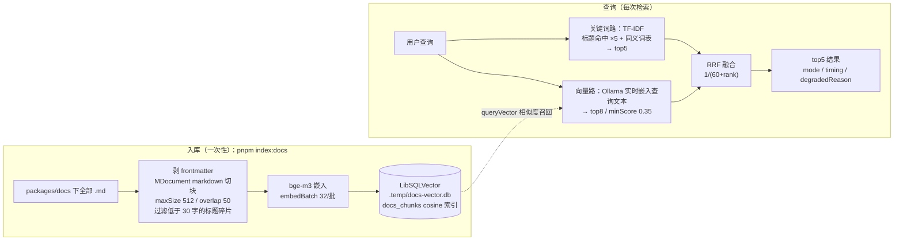

# 语义检索

docs-agent 的 `search_docs` 工具默认走关键词检索（同义词表 + TF-IDF 加权）。本篇讲它的语义升级——**本地 Ollama 向量化 + LibSQLVector 落盘 + 关键词/向量双路混合检索**，代码集中在 `packages/dev-server/src/rag/`（入库管线）与 `src/tools/search-docs.ts`（检索主入口），配置一个环境变量即启用。上手体验见[向量检索演示](/vector-search-demo)，端点明细见[接口文档](/mock-api)的「向量检索」分组，agent 装配背景见[智能体接入](/guide/mastra)。

## 从关键词到语义

真实失败案例：查询「**怎么让组件库支持英文**」——关键词路 0 命中，向量路第一条就是 `guide/i18n.md`。原因很直白：文档词汇收敛（写的是「国际化 / i18n / locale」），用户口语发散（问的是「支持英文」），字面匹配跨不过这道沟。`SYNONYMS` 同义词表是关键词路给这道沟打的补丁（20 余组口语映射），但清单只能跟着真实失败案例长，口语变体永远追不完。语义检索换思路：把查询与文档块映射到同一向量空间，按 cosine 相似度找近邻——「支持英文」与「国际化」在这个空间里本来就是邻居。

RAG（检索增强生成）的通用框架是五环节：**切块 → 向量化 → 检索 → 重排 → 评估**。本项目落地前三环节，且把检索升级为双路混合；**重排**（rerank，用 cross-encoder 对 top 召回二次精排）与**评估**（RAGAS 类忠实度/相关性打分）未实现，属于进阶——66 篇语料、top5 粗排已够用，语料量上来再补。

## 链路总览



**成本结构是这套链路可行的关键**：语料向量一次性入库、持久化在 `file:.temp/docs-vector.db`——66 篇文档全量切块嵌入约 30 秒；查询时**只嵌入查询文本这一条**（本地 Ollama 约 300ms），绝无「按查询重算语料」。只有文档变更或换 embedding 模型后才需要重跑入库。

启用三步：

```bash
# 1. 本地 Ollama 拉模型（一次性，约 1.2GB）
ollama pull bge-m3

# 2. packages/dev-server/.env
EMBEDDING_MODEL=bge-m3

# 3. 一次性入库（约 30 秒；文档变更或换模型后重跑）
cd packages/dev-server && pnpm index:docs
```

## 切块：markdown 策略 512 / 50

切块质量决定检索上限。语料是 VitePress markdown，标题、列表、代码块天然是语义边界，`markdown` 切块策略沿结构切，不会把一张 props 表从中间劈开。粒度取 512 字符 / 50 重叠：

```ts
// packages/dev-server/src/rag/index-docs.ts
const MIN_CHUNK_CHARS = 30 // 标题行等碎片块低于此长度不入库
const CHUNK_OPTIONS = { maxSize: 512, overlap: 50 } as const
```

- **512**：约对应 bge-m3 的语义单元——太小则块内信息密度低、噪声向量多；太大则相似度被稀释，且检索端 400 字片段会截断丢信息
- **overlap 50**：跨块的句子在邻块里留有上下文，命中边界附近的内容不丢
- **MIN_CHUNK_CHARS = 30**：冒烟实测 markdown 切块会产出 4~15 字的纯标题碎片块（「# 安装」之类），没有正文语义、向量近似随机方向，入库只会污染召回，直接丢弃
- **frontmatter 剥离**：每页顶部 `---` 包围的键值区（title/layout 等）是站点配置噪音，切块前剥掉

每个入库块携带 `{ source, title, text }` metadata——检索端取回片段不回读源文件，工具结果自带出处。

## 向量化：本地 Ollama bge-m3

缺省形态是本地 Ollama 跑 `bge-m3`：1024 维、中英多语言、约 1.2GB。中文文档 + 中文口语查询的场景，多语言模型是硬要求。embedding 工厂用 `@mastra/core` 的 `ModelRouterEmbeddingModel`，本地与云端同一条代码路径：

```ts
// packages/dev-server/src/rag/embedder.ts
// 裸模型名（bge-m3）补本地 Ollama 前缀；含 provider/ 的模型串原样透传
const id: `${string}/${string}` = /^[^/]+\/.+/.test(env.model)
  ? (env.model as `${string}/${string}`)
  : `ollama/${env.model}`
return new ModelRouterEmbeddingModel({ id, url: env.url, apiKey: env.apiKey })
```

三个环境变量（`packages/dev-server/.env`，参照 `.env.example`）：

| 变量 | 说明 | 缺省 |
| --- | --- | --- |
| `EMBEDDING_MODEL` | 裸名（`bge-m3`）走本地 Ollama；含 `provider/` 前缀（如 `openai/text-embedding-3-small`）原样透传 | 未配置即纯关键词检索 |
| `EMBEDDING_MODEL_URL` | OpenAI 兼容 `/embeddings` 端点，指向云端即整体切换 | `http://localhost:11434/v1` |
| `EMBEDDING_MODEL_API_KEY` | 端点 key | `ollama` |

工程细节两处：**构造不发网络请求**，首次 `doEmbed` 才连端点（Ollama 没启动时入库命令与工厂构造都不会假崩溃）；**embedBatch 按 32/批切**——Ollama 大批量易超时，不依赖模型侧的 `maxEmbeddingsPerCall`，按批调 `doEmbed` 并按原顺序展平，入库的 upsert 与 embed 同批（32 条一段）。

## 索引管理：探针定维与全量重建

**换模型 = 换维度 = 旧向量空间整体作废**（bge-m3 是 1024 维，text-embedding-3-small 是 1536 维）。入库管线用探针自动定维，免配置：

```ts
// 探针取实际维度（bge-m3=1024、text-embedding-3-small=1536 自动适配）
const probe = await options.embedder.doEmbed({ values: [pieces[0].text] })
const dimension = probe.embeddings[0]!.length
await ensureIndex(options.store, dimension, { rebuild: true })
```

`ensureIndex` 的防御逻辑：索引已存在且维度与当前模型不符时**显式报错而非静默写坏数据**，错误信息直接给出修复动作：

```text
向量索引维度不匹配：现有 1024 维，当前 embedding 模型输出 1536 维。
换模型必须重建索引：重跑 pnpm index:docs（全量管线自动删旧建新）
```

两个实测踩坑，已固化进代码注释：

- **全量重建走 `deleteIndex` + `createIndex`，而非 truncate**：libsql 向量索引（DiskANN）对已有向量 DELETE 后重插会报 `failed to insert shadow row`（实测 @mastra/libsql 1.21.0），drop + create 是唯一稳妥的全量重建路径，顺带天然兼容换模型换维度
- **测试不能用 `:memory:` 库**：LibSQLVector 的 `:memory:` 模式下，写事务与主连接是两个独立的内存库，写入读不回——`createDocsVectorStore(dbUrl)` 的参数就是为此留的注入口，测试用临时文件库

库文件 `docs-vector.db` 与会话记忆 `dev-server.db` 分文件：文档索引是可随时重建的派生数据，删库重灌不伤对话历史。

## 混合检索：关键词 + 向量 + RRF

检索主入口 `runSearch`（`search-docs.ts`）：`search_docs` 工具与 `/vector/search` 路由共用；`options.embedding` 显式传 `null` 可强制纯关键词路——对比演示的基线就是这么做出来的。

### 关键词路（纯本地读盘，无向量参与）

每次执行全量读盘建索引（66 篇 <1MB，dev 工具无需索引常驻）。评分是 TF-IDF 加标题加权：

```ts
const idf = Math.log(1 + index.length / (1 + df))
score += idf * (titleTf * 5 + bodyTf) // 标题命中 ×5
```

- **IDF 降权**：常见词（「组件」「使用」）在多数文档出现，df 高 → 权重低，稀有术语主导相关性
- **标题命中 ×5**：一~三级标题行合并参与加权，标题语义优先于正文高频引用（实测修正：正文被多次引用的文档曾反超标题命中的目标文档，×5 加权后回归）
- **SYNONYMS 同义词表仍在使用**：关键词路的口语扩展层（聊天气泡→bubble、暗色→dark、国际化→i18n 等），向量路是补充不是替代——组件英文名这类精确查询，字面匹配依然最准
- **splitCjkLatin 中英边界切分**：「Message组件」→ `message` + `组件`。无空格混排词整串在任何文档都不存在，实测 0 命中

### 向量路

```ts
const hits = await store.query({
  indexName: DOCS_INDEX_NAME,
  queryVector: embeddings[0]!, // 查询文本实时嵌入
  topK: 8, // VECTOR_TOP_K：融合前召回深度
  minScore: 0.35, // VECTOR_MIN_SCORE：bge-m3 实测无关块 < 0.3，直接滤掉
})
```

`topK 8` 是融合前的召回深度；返回已按相似度降序，**同 source 多块只取首个（即最高分块）**——文档级去重发生在融合之前，一个文档不会用三个块占满席位。

### RRF 融合

两路的分数量纲无关：向量路是 0~1 的 cosine 相似度，关键词路是几到几十的 TF-IDF 加权分，直接加权没有意义。RRF（Reciprocal Rank Fusion）只看名次不看分值：

```ts
fusedScore += 1 / (60 + rank) // rank 从 1 计；k=60 为业界标准
```

双路同 source 合并规则：snippet 取向量路（块级定位更准），matchedTerms 取关键词路（保留字面命中证据）。融合后截 top5。

一个实用判据：**融合分永远落在 0.015~0.033 的小数区间**（单路 top1 ≈ 0.016，双路双 top1 ≈ 0.033），而关键词路独立返回的分数是 TF-IDF 大数——在演示页看两栏分数的量级，走向一眼可辨。

## 降级与可观测

设计原则：**向量路永远不把工具拖崩**。

- `EMBEDDING_MODEL` 未配置 → 向量路直接跳过（不是失败），纯关键词检索
- 向量路任何失败（Ollama 未启动 / 索引未建 / 维度不符）→ catch 住降级，`degradedReason` 带原因，工具照常返回关键词结果
- `timing.vectorMs = 0` 表示**未配置未尝试**（非失败）；`> 0` 且 `degradedReason` 存在才是真失败
- `mode` 字段记录实际走向：`'hybrid'`（向量路有产出）或 `'keyword'`

可观测走 Mastra logger，每次检索落一条结构化日志：

```ts
context?.mastra?.getLogger()?.info('检索文档', {
  query,
  mode: outcome.mode,
  hits: outcome.results.length,
})
// 降级时另有 warn('语义检索路失败，已降级纯关键词', { error })
```

进程日志 `grep 检索文档`（或 Studio 线的 Observability 视图）即可看到每次查询的走向与命中数。

## /vector 端点与演示页

dev-server 挂载三个调试端点（`src/routes/vector.ts`，前端经 `/api/vector/*` 访问）：

| 端点 | 参数 | 用途 |
| --- | --- | --- |
| `GET /vector/stats` | —— | 索引状态：embedding 配置、引擎描述（`engine/location`）、块数、维度、metric。未配置返回 `{ enabled: false }`；读库失败带 `error` 不崩 |
| `POST /vector/search` | body `{ query }`（非空字符串，否则 400） | 同一查询双路对比：`keyword` 是强制 `embedding: null` 的基线，`hybrid` 走 env 实况（含降级）。响应含 `mode`、`degradedReason`、两路各自 `timing` |
| `GET /vector/chunks` | `page`（≥1）、`pageSize`（默认 20，上限 50）、`source`（按文档精确过滤）、`q`（块文本 LIKE） | 向量库浏览：`node:sqlite` 直读 `docs_chunks` 表分页列出全部分块——MastraVector 接口没有「全量 list」方法，本地文件库直查是最直接的途径 |

[向量检索演示](/vector-search-demo)页消费这三者，双 tab：**检索对比**（同一查询左右双路结果 + 链路各环节实时耗时，能直观看到「支持英文」左路 0 命中、右路命中 i18n 文档）与**向量库浏览**（分页 + source/q 过滤，直接看每个入库块的文本与字数）。

## 选型摘要

向量库三种形态一句话带过：**专用**（Qdrant、Milvus——为向量而生，索引与过滤能力最全）、**扩展型**（PgVector、LibSQL——在既有数据库上加向量能力，运维零增量）、**云托管**（Pinecone、Turso——免运维、按量付费）。本项目选 LibSQLVector 的三个理由：

1. **零新增服务与依赖**：`@mastra/libsql` 本来就装着（会话记忆在用），`LibSQLVector` 同包导出，本地 Ollama 组合下整套 RAG 完全离线可跑
2. **统一接口，换库只动一行**：MastraVector 的 `createIndex / upsert / query` 签名跨库一致，换 Qdrant 只改 `vector-store.ts` 的工厂一处，切块、嵌入、融合全部业务代码零改动
3. **量级匹配**：数百个向量的语料，本地文件库毫秒级返回；专用库的十亿级 ANN 索引能力在这里用不上

换库时记得同步改 `DOCS_VECTOR_STORE_DESC`（`vector-store.ts` 里与工厂并排的引擎描述）——它是 stats 端点与演示页引擎展示的数据源，改一处，展示层自动如实呈现新引擎。
